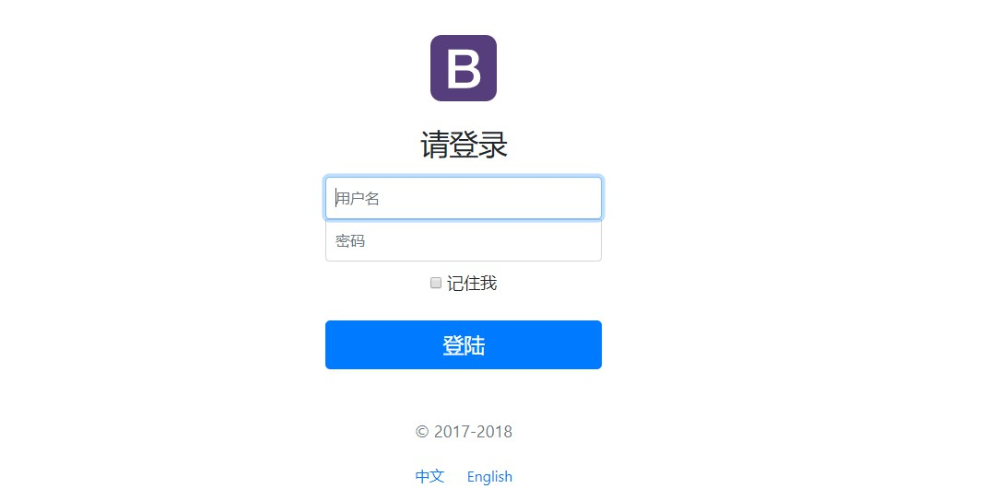
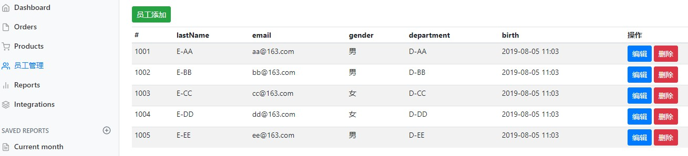
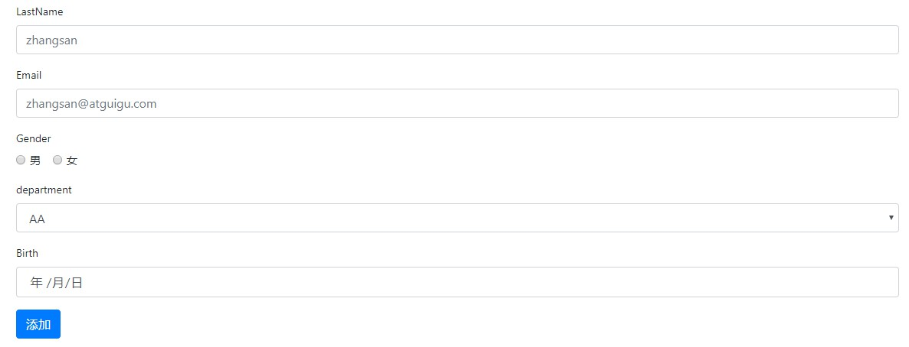

# Employee-System

## 简介

`REST` 风格的 **`CURD` 员工管理系统**


**前端**: **`Thymeleaf`** + **`Bootstrap`**

**后端**: **`Spring MVC`** + **`Spring Boot`** + **`Mybatis`** + **`MySQL`**


### 效果图

**登录界面**



**主界面**



**添加页面**




## 项目结构

```
 src
  ├─main
  │  ├─java
  │  │  └─com
  │  │      └─example
  │  │          └─emysys
  │  │              │  SpringBoot04WebRestfulcrudApplication.java
  │  │              │
  │  │              ├─component
  │  │              │
  │  │              ├─config
  │  │              │
  │  │              ├─controller
  │  │              │
  │  │              ├─dao
  │  │              │
  │  │              ├─entities
  │  │              │
  │  │              ├─exception
  │  │              │
  │  │              ├─filter
  │  │              │
  │  │              ├─listener
  │  │              │
  │  │              ├─mapper
  │  │              │
  │  │              └─servlet
  │  │
  │  └─resources
  │      
  └─test
```

## 配置方法

### 数据库配置

1. **服务配置**
    - 访问路径
    - 端口号


2. **数据库配置**
    - url
    - user
    - password


```yml
server:
  port: 8081
  context-path: /curd
  tomcat:
    uri-encoding: UTF-8

spring:
  mvc:
    date-format: yyyy-MM-dd

  messages:
    basename: i18n.login

  http:
    encoding:
      force: true
      charset: utf-8
      enabled: true

  datasource:
    # useUnicode=true&characterEncoding=utf-8 指定连接的编码，解决乱码
    url: jdbc:mysql://localhost:3306/empsys?serverTimezone=UTC&ENGINE=InnoDB&useUnicode=true&characterEncoding=utf-8
    username: root
    password:
    driver-class-name: com.mysql.jdbc.Driver
```

### 建表

> 建表用到的 `sql` 文件保存在了 `resources/sql` 文件夹下

```
resources
    └─sql
         department.sql
         employee.sql
```

### 登录密码

这里先把登录的密码写死了，默认的登录密码为
    - **账号**: 任意
    - **密码**:  123456

```java
// com.example.empsys.contorller.LoginController

@Controller
public class LoginController {

    @PostMapping(value = "/user/login")
    public String login(@RequestParam("username") String username,
                        @RequestParam("password") String password,
                        Map<String,Object> map, HttpSession session){
        if (!StringUtils.isEmpty(username) && "123456".equals(password)){
            // 登陆成功，防止表单重复提交，可以重定向到主页
            session.setAttribute("loginUser", username);
            return "redirect:/main.html";
        } else {
            // 登陆失败
            map.put("msg","用户名密码错误");
            return  "login";
        }
    }

}
```

## 收获

### 难点

1. **登录验证** 登陆后才能获取操作权限，通过拦截器实现
2. **重复提交** 登录提交通过重定向完成，避免刷新出现表单重复提交的问题
3. **表单回显** 让修改操作和插入操作共用同一个页面


### 遇到的问题

1. 不知道引用类型在数据库中如何保存 
    > 通过 `MyBatis` 获取了 `Map<Integer, Department>`，同时放到 `HttpRequest` 中，通过 `Employee.dId` 属性来获取对应的 `Department.departName`